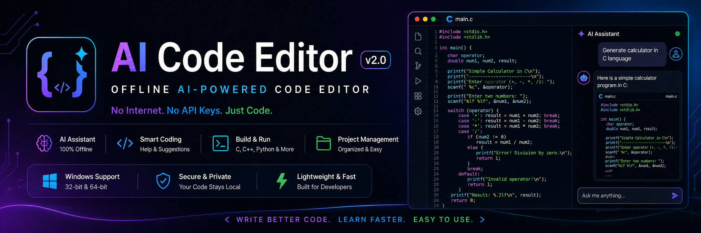
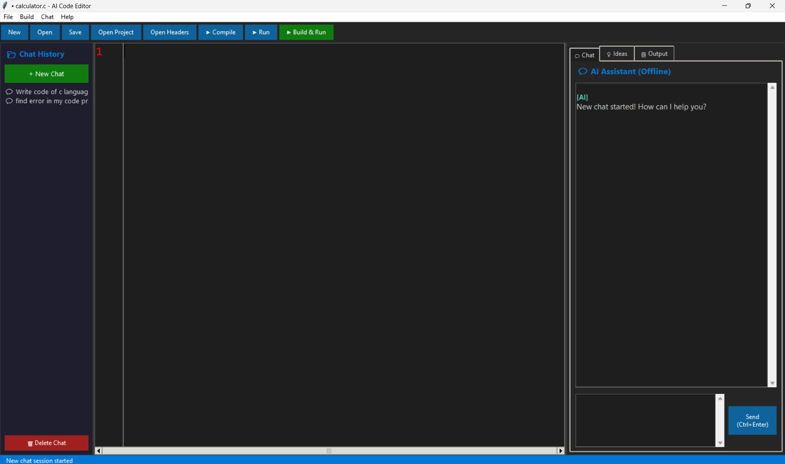
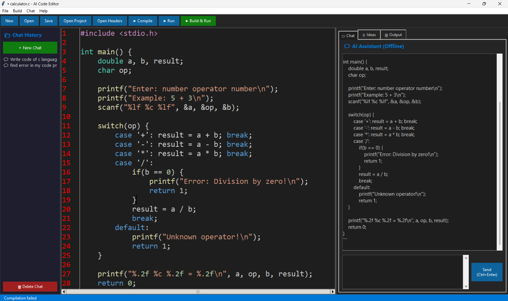

<div align="center">
  

  <h1>🤖 AI Code Editor v2.0</h1>
  <p><strong>Offline AI-Powered Code Editor — No Internet. No API Keys. Just Code!</strong></p>

  <p>
    
    
    
    
  </p>

  <p>
    A lightweight, fully offline code editor with a built-in AI assistant.<br/>
    No internet required. No API keys. No subscriptions. Just install and code!
  </p>
</div>

---

## 📸 Screenshots

<div align="center">
  
  <p><em>🖥️ Dark theme editor with syntax highlighting</em></p>
</div>

<br/>

<div align="center">
  
  <p><em>🤖 AI Assistant helping with code — 100% offline</em></p>
</div>

---

## ✨ Features

<table>
<tr>
<td width="50%" valign="top">

### 🤖 AI Assistant (100% Offline)
- Chat with AI about any coding topic
- Get instant help with errors & bugs
- AI explains concepts in simple terms
- Ask for code examples in any language
- AI learns from your conversations
- Chat history saved & searchable

</td>
<td width="50%" valign="top">

### 📝 Smart Code Editor
- Syntax highlighting for 8+ languages
- Line numbers & auto-indentation
- Dark theme — easy on eyes
- Large readable fonts
- Context menu (right-click Cut/Copy/Paste)

</td>
</tr>
<tr>
<td width="50%" valign="top">

### ⚡ Compiler & Runner
- One-click compile for C/C++
- Run Python, JavaScript, PHP directly
- Build & Run with single button (F5)
- Output panel shows results & errors

</td>
<td width="50%" valign="top">

### 💡 Smart Suggestions
- Code analysis detects common mistakes
- Missing includes/imports detection
- Bracket & parenthesis matching
- Memory leak warnings
- Style & best practice tips

</td>
</tr>
<tr>
<td width="50%" valign="top">

### 📂 Project Management
- Open project folders
- Open header files
- File browser in output panel
- Save/load chat sessions

</td>
<td width="50%" valign="top">

### 🧠 AI Knowledge Base
- 50+ coding concepts explained
- 20+ ready-to-use code templates
- 30+ error diagnostics
- Covers: DSA, OOP, Design Patterns, Git & more
- AI gets smarter the more you use it!

</td>
</tr>
</table>

---

## 🌐 Supported Languages

<p>
  
  
  
  
  
  
  
  
  
</p>

|
 Language 
|
 Extensions 
|
 Run/Compile 
|
|
----------
|
-----------
|
-------------
|
|
 C 
|
`.c`
|
`gcc`
 → compile & run 
|
|
 C++ 
|
`.cpp`
`.hpp`
|
`g++`
/
`clang++`
 → compile & run 
|
|
 Python 
|
`.py`
|
`python`
 → run directly 
|
|
 Java 
|
`.java`
|
`javac`
 + 
`java`
|
|
 JavaScript 
|
`.js`
|
`node`
 → run directly 
|
|
 PHP 
|
`.php`
|
`php`
 → run directly 
|
|
 HTML 
|
`.html`
|
 Opens in browser 
|
|
 CSS 
|
`.css`
|
 Used with HTML 
|
|
 SQL 
|
`.sql`
|
 Syntax highlighting 
|

---

## 🚀 Quick Start

> **Get up and running in 2 minutes!**

### 📦 Requirements

|
 Required 
|
 Optional 
|
|
----------
|
----------
|
|
 ✅ Python 3.8+ 
[
Download
](
https://www.python.org/downloads/
)
|
 ✅ GCC/Clang (for C/C++ compiling) 
|
❌ NO internet connection needed
❌ NO Ollama or external AI tools
❌ NO API keys or accounts
❌ NO paid subscriptions

text

### Step 1: Install Python

Download from **[python.org](https://www.python.org/downloads/)**

> ⚠️ **IMPORTANT:** During installation, CHECK ✅ **"Add Python to PATH"**

### Step 2: Run the Editor

**Option A:** Double-click `RUN_EDITOR.bat`

**Option B:** Command Prompt

```bash
python AI_Code_Editor_Offline.py
That's it! 🎉 The editor will open and you can start coding.

🔨 Build Standalone EXE (Optional)
Want a .exe that runs without Python installed?

bash
# Step 1: Double-click BUILD_EXE.bat
# OR manually run:
pip install pyinstaller
pyinstaller --onefile AI_Code_Editor_Offline.py
Find your EXE at: dist/AICodeEditor.exe

💡 Share it with friends — no Python needed to run it!

🤖 AI Assistant — What Can You Ask?
💬 General
text
"hi" or "hello"
"what can you do"
"tell me a joke"
📝 Request Code
text
"write hello world in C"
"create a calculator in python"
"make a linked list in C"
"write binary search"
"write a login system in python"
📖 Learn Concepts
text
"explain pointers"
"what is OOP"
"what is recursion"
"explain big O notation"
"difference between C and C++"
🔧 Fix Errors
text
"fix segfault"
"what is a null pointer"
"explain syntax error"
"fix memory leak"
"what does TypeError mean"
💻 Code Analysis
text
"check my code"
"analyze my code"
"what's wrong with my code"
"review this"
🔄 Other
text
"how to compile"
"how to learn C"
"best practices"
"naming conventions"
💡 Tips: Be specific! The AI remembers conversation context. Chat history is saved automatically. Click "+ New Chat" to start fresh.

⌨️ Keyboard Shortcuts
Shortcut	Action
Ctrl + N	New file
Ctrl + O	Open file
Ctrl + S	Save file
Ctrl + B	Compile
Ctrl + R	Run
F5	Build & Run
Ctrl + Z	Undo
Ctrl + Y	Redo
Ctrl + A	Select All
Ctrl + C / V / X	Copy / Paste / Cut
Ctrl + Enter	Send message to AI
📁 Project Structure
text
AI_CODE_EDITOR_PROJECT/
│
├── 📄 AI_Code_Editor_Offline.py    ← Main application
├── 📄 RUN_EDITOR.bat                ← Quick launcher
├── 📄 BUILD_EXE.bat                 ← EXE builder
├── 📄 README.md                     ← This file
├── 📄 requirements.txt              ← Dependencies
├── 📄 .gitignore                    ← Git ignore rules
│
├── 📁 assets/                       ← Screenshots & images
├── 📁 chats/                        ← Saved chat sessions
├── 📁 code/                         ← Your code files
├── 📁 headers/                      ← Header files
├── 📁 data/                         ← AI learned knowledge
├── 📁 build/                        ← PyInstaller temp
└── 📁 dist/                         ← Standalone EXE
🔧 Troubleshooting
❓ "python is not recognized"
❓ Editor won't open
❓ Compile button doesn't work
❓ "Compiler not found"
❓ AI gives generic responses
❓ Chat history not saving
❓ BUILD_EXE.bat fails
❓ EXE flagged by antivirus
🛠️ About This Project
This is an offline AI-powered code editor developed as a freelance project.

My contributions:

🔧 Removed external AI dependencies (Ollama)
🤖 Built offline AI assistant with knowledge base
💬 Added chat history & session management
🌐 Multi-language editor support (C, C++, Python, Java, JS, PHP, HTML, SQL)
🎨 Complete UI redesign with dark theme
💡 Code analysis & suggestions system
Built with ❤️ and Python

⭐ Star this repo if you found it useful!


All your data stays on YOUR computer. Nothing is sent anywhere. Complete privacy. 🔒

```